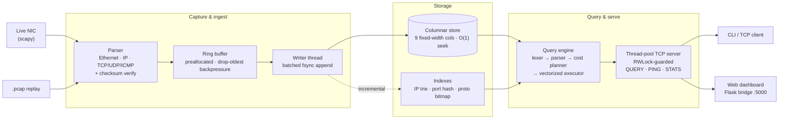
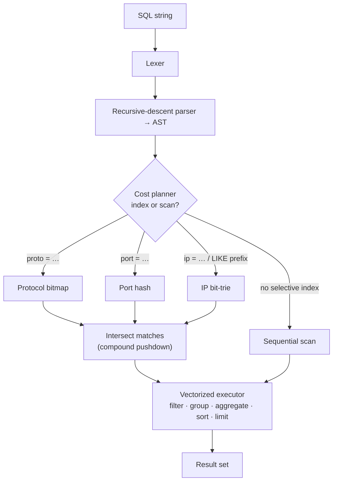
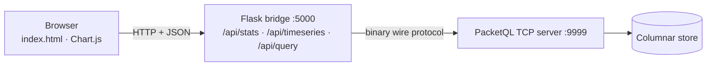

<div align="center">

# PacketQL

### A live network packet analyzer with a SQL query engine — built from scratch in Python.

Capture packets off the wire, hand-decode every header, store them in a custom
columnar format, index them three ways, and query the traffic with SQL.


</div>

```sql
SELECT src_ip, dst_port, size FROM packets
WHERE proto = 6 AND size > 1500
ORDER BY size DESC LIMIT 50;
```

Everything is integer-native: IPs are **uint32**, protocol is the raw IANA number,
alongside `tcp_flags` and `ttl` — see the locked
[`PacketRecord` schema](packetql/schema.py) and the per-module
[contracts](CONTRACTS.md). The offline path is **standard-library only**; `scapy`
is required only for live capture, and `Flask` only for the web dashboard.

---

## Contents

- [Highlights](#highlights)
- [Architecture](#architecture)
- [How a query executes](#how-a-query-executes)
- [Built across four subjects](#built-across-four-subjects)
- [Quickstart](#quickstart-offline--standard-library-only)
- [Live capture](#live-capture-needs-npcap--administrator)
- [Query over TCP](#query-over-tcp-binary-protocol--thread-pool)
- [Web dashboard](#web-dashboard)
- [Query language](#query-language)
- [Benchmarks](#benchmarks)
- [Testing](#testing)
- [Scope & honest limitations](#scope--honest-limitations)
- [Future work](#future-work)
- [Documentation](#documentation)

---

## Highlights

- **Hand-decoded protocol stack** — Ethernet → IP → TCP/UDP/ICMP parsed byte-by-byte, with **IP-checksum verification** (corrupt frames are flagged, not silently stored).
- **Custom columnar store** — nine fixed-width columns, **O(1) seek** to any field, page-cache friendly. ~12× less data scanned than a row store for single-column queries.
- **Three purpose-built indexes** — a **depth-32 bit-trie** for IP prefixes, a **direct-address hash** for ports, and a **bitmap** for protocols — which the planner **intersects** for compound predicates.
- **A real query engine** — lexer → recursive-descent parser → **cost-based planner** → **vectorized executor**, with `GROUP BY`/`HAVING`, scalar aggregates, `DISTINCT`, and `EXPLAIN`.
- **Concurrent access** — a binary-protocol TCP server backed by a thread pool and a **readers-writer lock**, plus a single-file web dashboard.

---

## Architecture



---

## How a query executes

The planner chooses the cheapest access path per predicate, then intersects index
results when a compound `WHERE` is more selective than any single index.



---

## Built across four subjects

| Subject | What it demonstrates |
|---|---|
| **Computer Networks** | hand-decoding headers **with IP-checksum verification**; a binary-protocol TCP server |
| **Operating Systems** | producer/consumer ring buffer with adaptive backpressure; thread pool; a **readers-writer lock** |
| **Data Structures** | **bit-level depth-32 IP trie**, **direct-address port hash**, **protocol bitmap**, ring buffer, top-N heap |
| **Databases** | fixed-width **columnar store**; SQL lexer / parser / **cost planner** / **vectorized executor**; **GROUP BY · HAVING · aggregates · DISTINCT · EXPLAIN** |

---

## Quickstart (offline — standard library only)

```bash
python tools/make_fixture_pcap.py   # write tests/fixtures/sample.pcap (valid checksums + 1 corrupt)
python demo.py                      # parse → columnar store → indexes → queries (with plans)
python query.py --store data/demo_store "SELECT proto, dst_port, size FROM packets WHERE proto = 6"
python benchmarks/benchmark_suite.py
```

`query.py` with no SQL opens an interactive prompt. IP / protocol / flags columns are
rendered human-readably (`192.168.0.2`, `TCP`, `SYN|ACK`); the engine stores them as
integers.

## Live capture (needs Npcap + Administrator)

```bash
pip install scapy                   # plus Npcap from https://npcap.com (install as Admin)
# in an Administrator terminal:
python -c "from packetql.capture.pipeline import capture_live; p = capture_live('data/live_store', count=50, timeout=20); print('captured', p.written, 'dropped', p.dropped)"
python query.py --store data/live_store
```

## Query over TCP (binary protocol + thread pool)

```bash
python -m packetql.server --store data/demo_store    # thread-pool server, no admin needed
python query_client.py                               # connect; type SQL, '.ping', '.stats'
```

**Wire protocol.** A request is `[4-byte length][1-byte type]` (`QUERY` / `PING` /
`STATS`); a response is `[4-byte length][1-byte status]` followed by results encoded
**column-major** in binary. Reads loop until the full message arrives — TCP has no
message boundaries.

## Web dashboard

A single-file dashboard (live stat cards, traffic timeline, protocol mix, top talkers,
port activity, and a query console) served by a thin Flask bridge that speaks
PacketQL's binary wire protocol.



```bash
pip install -r dashboard/requirements.txt
python -m packetql.server --store data/demo_store    # 1) backend on :9999
python dashboard/bridge.py                            # 2) bridge on :5000
# 3) open http://127.0.0.1:5000/
```

The bridge adapts to what the **read-only** query server actually exposes — it never
modifies the engine. Total packets, protocol mix, and top talkers are always real;
packets/sec and bytes/sec are non-zero only while a live capture appends to the served
store, and `drop_rate_pct` is always `0.0` (drops are a capture-pipeline metric the
query server doesn't surface). See [dashboard/README.md](dashboard/README.md) for the
full honest-scope notes.

## Query language

```
SELECT [DISTINCT] cols | aggregates | * FROM packets
  [WHERE expr] [GROUP BY cols [HAVING expr]] [ORDER BY col [ASC|DESC]] [LIMIT n]
EXPLAIN <select>
```

Aggregates `COUNT(*)`, `COUNT/SUM/AVG/MIN/MAX(col)`; operators `= != <> < > <= >=` with
`AND / OR / NOT` and parentheses; `LIKE 'prefix%'` for IP subnets. Columns:
`ts, src_ip, dst_ip, src_port, dst_port, proto, size, flags, ttl`. IP literals
(`src_ip = '192.168.0.2'`) are converted to uint32 in the parser. The planner picks
**bitmap** (protocol), **hash** (port), or **trie** (IP) and **intersects** them when
more selective than a scan; grouping uses a **hash-aggregate**.

```sql
-- top protocols by traffic
SELECT proto, COUNT(*), SUM(size) FROM packets GROUP BY proto ORDER BY COUNT(*) DESC;
```

---

## Benchmarks

In-process microbenchmarks (warm cache, single machine) — *relative* behaviour, not
production latency. Numbers match [benchmarks/REPORT.md](benchmarks/REPORT.md);
regenerate with `python benchmarks/benchmark_suite.py`.

| Measurement | Result |
|---|---|
| Scan vs index, `dst_port = 443` | 100K **356×** · 500K **258×** · 1M **140×** faster |
| Columnar vs row-store (one column) | **12.5× less data**, ~1.9× faster (200K rows) |
| Write throughput by batch | batch 1: 104 → batch 100: ~11K → batch 1000: ~91K packets/s |
| Concurrent clients (1 / 4 / 8) | ~1,100 / ~1,190 / ~1,060 queries/s (GIL-bound) |

> The index-vs-scan speedup narrows at 1M because a non-unique equality returns ~N/10
> matching rows — the win is in *skipping* rows, and there are simply more to return.

---

## Testing

```bash
pytest                                  # 75 tests
pytest --ignore=tests/test_bridge.py    # 66 core engine tests (no Flask needed)
```

The **66 core tests** cover the parser, indexes, storage, query engine, aggregates,
the wire protocol, and the readers-writer lock. The **9 dashboard tests**
([tests/test_bridge.py](tests/test_bridge.py)) drive the bridge against a real server
on an ephemeral port and assert its degradation paths directly — `503` when the backend
is genuinely stopped, the `200`-with-`error` contract for SQL errors (distinct from
transport failure), and the deliberate `/api/timeseries` "empty, never 503" asymmetry.

---

## Scope & honest limitations

- **IPv4 only.** The uint32 schema means IPv6 (and VLAN-tagged) frames are **discarded
  by the parser**, not mis-stored.
- **The bit-trie is memory-heavy at very large N** (a node per address bit); a
  path-compressed / radix trie would be the production answer.
- **Concurrency is GIL-bound** — more clients don't scale CPU-bound query work linearly;
  the thread pool still helps with I/O-bound and bursty load.
- **`LIKE` supports only a trailing-`%` prefix**; the top-N heap's advantage is asymptotic
  (O(m log N) time, O(N) memory), not a wall-clock race against C's `sorted`.

## Future work

Path-compressed trie, IPv6 / VLAN decoding, TCP stream reassembly, BPF capture filters,
richer SQL (joins, windowing), and the `pcapng` format.

## Documentation

| Doc | What's in it |
|---|---|
| [RUNBOOK.md](RUNBOOK.md) | every command to run the project, from scratch |
| [CLAUDE.md](CLAUDE.md) | architecture and phase plan |
| [CONTRACTS.md](CONTRACTS.md) | per-module contracts |
| [INTERVIEW.md](INTERVIEW.md) | interview defense pack |
| [dashboard/README.md](dashboard/README.md) | dashboard setup and honest-scope metrics |
| [benchmarks/REPORT.md](benchmarks/REPORT.md) | full benchmark report |
